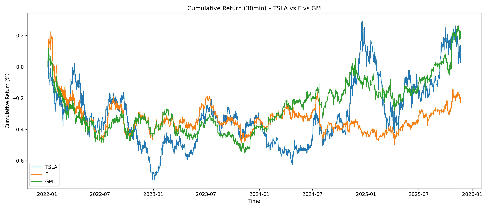
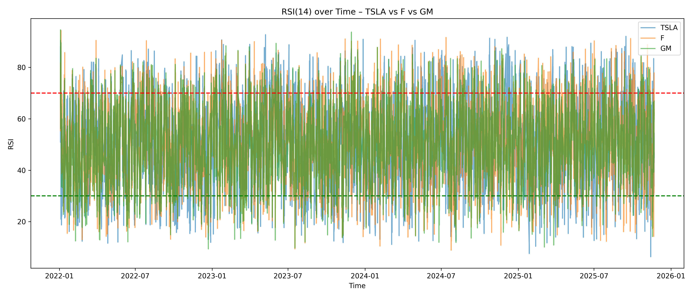
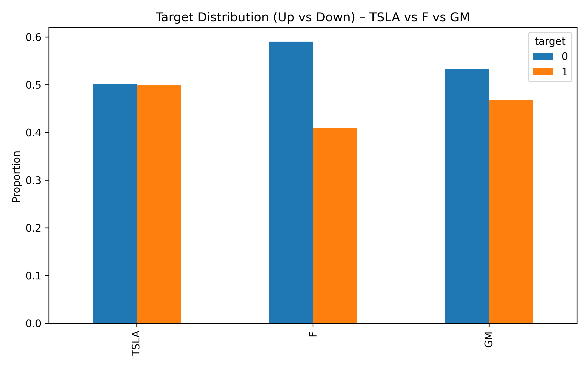
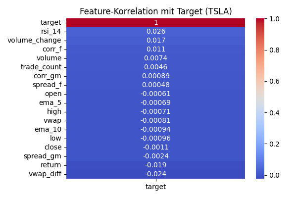

# Directional Stock Prediction: Tesla (TSLA) Next-Day Movement

## Problem Definition

### Target
Predict whether **Tesla’s stock (TSLA)** will move **up (1)** or **down (0)** in the **next 30-minute interval**.

The direction is defined as:

\[
target = 1 \; \text{if} \; close_{t+1} > close_t,\; else\; 0
\]

### Motivation
Automotive stocks often co-move due to:

- shared supply chains (batteries, chips, EV markets)
- earnings cycles and macroeconomic factors
- regulatory announcements (EV subsidies, tariffs)

We test whether **Ford (F)** and **General Motors (GM)** contain **predictive signals** for **Tesla** at an intraday level.

---

## Input Features

Our model uses technical indicators and cross-stock signals:

| Feature | Meaning |
|--------|---------|
| `return` | Tesla percentage change of current bar |
| `ema_5`, `ema_10` | short-term exponential moving averages |
| `rsi_14` | momentum oscillator (14 periods) |
| `volume_change` | percentage delta of volume |
| `vwap_diff` | deviation of price from VWAP |
| `corr_f`, `corr_gm` | rolling correlations between TSLA and F/GM |
| `spread_f`, `spread_gm` | relative price spreads vs F/GM |

---

## Procedure Overview

1. **Retrieve raw 30-minute market bars** for TSLA, F, GM
2. **Compute engineered features** for Tesla & cross-signals from Ford and GM
3. **Define binary classification target** for next 30-minute direction
4. **Inspect descriptive statistics and distributions**
5. **Prepare model-ready feature matrices (pre-split)**

---

## Step 1 – Data Acquisition

Raw prices are retrieved using **Alpaca Paper Trading API**:

- Endpoint: `/v2/stocks/{symbol}/bars`
- Interval: `30min`
- Symbols: `TSLA`, `F`, `GM`
- Period: ~3 years of intraday history

Saved under: 
/experiments/data/raw

Sample raw columns:
timestamp | open | high | low | close | volume | vwap | trade_count

---

## Step 2 – Data Understanding

We explore market behavior and relative movement among the three symbols.

### Close Price Comparison (TSLA vs F vs GM)

Tesla clearly exhibits higher volatility and larger intraday swings compared to Ford and GM.

### Percentage Change Comparison

To normalize price levels, we evaluate *returns* instead of absolute prices:

Tesla shows more frequent and larger spikes in return intensity.

### RSI Distribution

Momentum behaves differently across stocks; Tesla tends to reach extreme RSI ranges faster:

### Target Distribution

Our prediction objective is balanced enough for classification tasks:

---

## Step 3 – Pre-Split Data Preparation

Performed in:
scripts/03_pre_split_prep/03_pre_split_prep.py

### How features and targets were prepared

✔️ Loaded raw Tesla bars  
✔️ Engineered EMAs, RSI, VWAP deviation  
✔️ Added Ford/GM correlations and spreads  
✔️ Created binary next-bar direction target  
✔️ Removed NaNs and saved pre-processed Parquet files:

/experiments/data/features/tsla_features_30min.parquet

### Example Feature Snapshot
close | return | ema_5 | ema_10 | rsi_14 | corr_f | corr_gm | target

### Feature Statistics

Even though individual correlations appear weak (common in financial series),  
**multi-feature interaction can yield predictive power**.

---

## Findings So Far

🔍 Observations:

- Tesla exhibits the largest intraday volatility among automotive peers
- Ford and GM show **non-zero rolling correlations**, confirming shared sector behavior
- Technical indicators such as **RSI and EMA deltas** reveal trend shifts
- Intraday returns provide a more meaningful signal than raw prices

📌 Hypothesis strengthened:

> *Ford and GM contain early signals that can anticipate movement in TSLA.*

---

## Next Steps

🚀 **Train ML models** using engineered features:

- Logistic Regression / Random Forest baseline
- Neural network classifier (optional)
- Evaluate prediction horizon beyond 30min

💡 **Deploy trading strategy** via Alpaca Paper Trading

---

## Repository Structure

/experiments
├─ data
│ ├─ raw/ # downloaded Alpaca bars
│ └─ features/ # engineered parquet features
├─ images/ # plots used in this README
└─ scripts/ # acquisition & preprocessing code

