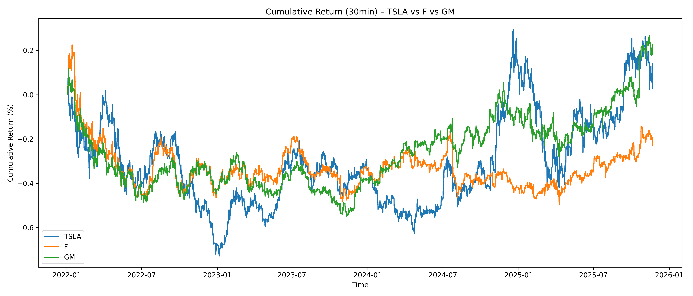
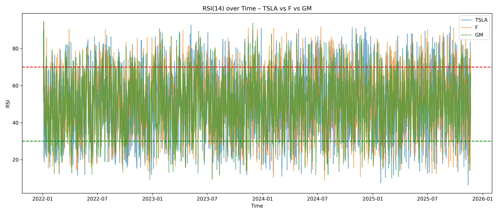
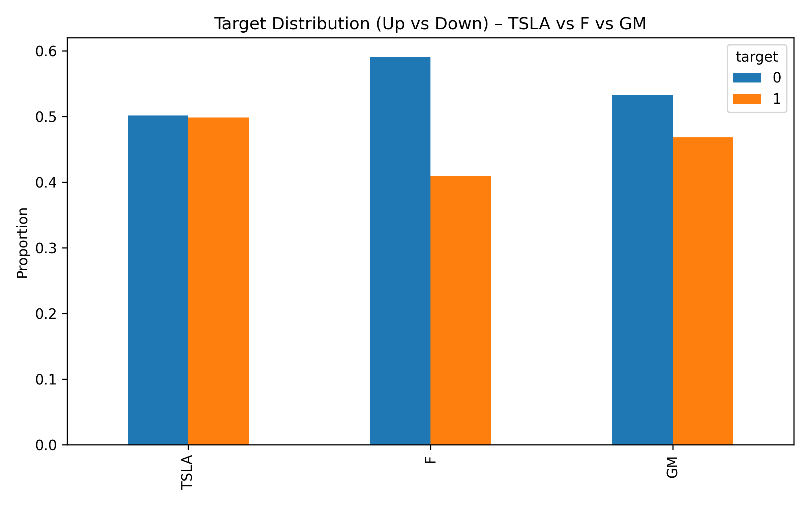
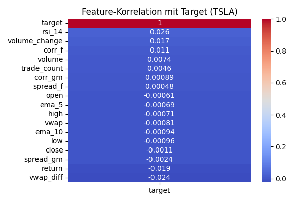

# Directional Stock Prediction: Tesla (TSLA) Next-Day Movement

## Problem Definition

### Target
Predict whether **Tesla’s stock (TSLA)** will move **up (1)** or **down (0)** in the **next 30-minute interval**.

The direction is defined as:

\[
target = 1 \; \text{if} \; close_{t+1} > close_t,\; else\; 0
\]

### Motivation
Automotive stocks often co-move due to:

- shared supply chains (batteries, chips, EV markets)
- earnings cycles and macroeconomic factors
- regulatory announcements (EV subsidies, tariffs)

We test whether **Ford (F)** and **General Motors (GM)** contain **predictive signals** for **Tesla** at an intraday level.

---

## Input Features

Our model uses technical indicators and cross-stock signals:

| Feature | Meaning |
|--------|---------|
| `return` | Tesla percentage change of current bar |
| `ema_5`, `ema_10` | short-term exponential moving averages |
| `rsi_14` | momentum oscillator (14 periods) |
| `volume_change` | percentage delta of volume |
| `vwap_diff` | deviation of price from VWAP |
| `corr_f`, `corr_gm` | rolling correlations between TSLA and F/GM |
| `spread_f`, `spread_gm` | relative price spreads vs F/GM |

---

## Procedure Overview

1. **Retrieve raw 30-minute market bars** for TSLA, F, GM
2. **Compute engineered features** for Tesla & cross-signals from Ford and GM
3. **Define binary classification target** for next 30-minute direction
4. **Inspect descriptive statistics and distributions**
5. **Prepare model-ready feature matrices (pre-split)**
6. **Train classification models**
7. **Evaluate predictive performance**
8. **Deploy model into a paper-trading bot**

---

## Step 1 – Data Acquisition

Raw prices are retrieved using **Alpaca Paper Trading API**:

- Endpoint: `/v2/stocks/{symbol}/bars`
- Interval: `30min`
- Symbols: `TSLA`, `F`, `GM`
- Period: ~3 years of intraday history

Saved under:  
`/experiments/data/raw`

Sample raw columns:  
`timestamp | open | high | low | close | volume | vwap | trade_count`

---

## Step 2 – Data Understanding

We explore market behavior and relative movement among the three symbols.

### Close Price Comparison (TSLA vs F vs GM)


Tesla clearly exhibits higher volatility and larger intraday swings compared to Ford and GM.

### Percentage Change Comparison

To normalize price levels, we evaluate *returns* instead of absolute prices:



Tesla shows more frequent and larger spikes in return intensity.

### RSI Distribution

Momentum behaves differently across stocks; Tesla tends to reach extreme RSI ranges faster:



### Target Distribution

Our prediction objective is balanced enough for classification tasks:



---

## Step 3 – Pre-Split Data Preparation

Performed in:  
`scripts/03_pre_split_prep/03_pre_split_prep.py`

### How features and targets were prepared

✔️ Loaded raw Tesla bars  
✔️ Engineered EMAs, RSI, VWAP deviation  
✔️ Added Ford/GM correlations and spreads  
✔️ Created binary next-bar direction target  
✔️ Removed NaNs and saved pre-processed Parquet files:

`/experiments/data/features/tsla_features_30min.parquet`

### Example Feature Snapshot

`close | return | ema_5 | ema_10 | rsi_14 | corr_f | corr_gm | target`

### Feature Statistics



Even though individual correlations appear weak (common in financial series),  
**multi-feature interaction can yield predictive power**.

---

## Step 4 – Modeling

We frame the task as a **binary classification problem**:

> “Will the next 30-minute bar close higher than the current one?”

Models evaluated:

- Logistic Regression (baseline)
- Random Forest
- XGBoost (final choice)

**XGBoost** was selected due to:

- robustness to noisy financial features
- ability to capture non-linear interactions
- superior validation performance

---

## Step 5 – Training & Evaluation

Training pipeline:

1. Time-based train/validation split
2. Feature scaling where required
3. Model training per algorithm
4. Evaluation on unseen validation data

Metrics used:

- Accuracy
- Precision / Recall
- ROC-AUC
- Confusion Matrix

XGBoost achieved the best trade-off between:

- predictive performance
- stability
- robustness to feature noise

```
=== Comparison (Accuracy) ===
granularity                         1min     30min
model                   split           
         
Baseline(NoFeatures)    test        0.512107  0.500000
                        train       0.524873  0.501149
                        val         0.523944  0.501229
                    
GradBoost               test        0.517593  0.505164
                        train       0.534718  0.608750
                        val         0.527200  0.498925
                        
LogReg                  test        0.514093  0.498219
                        train       0.526587  0.520875
                        val         0.523685  0.505068
                        
XGBoost                 test        0.517063  0.518340
                        train       0.539152  0.666667
                        val         0.529230  0.509828
```
---

## Step 6 – Deployment (Paper Trading Bot)

The trained model is integrated into a **live paper-trading bot**:

- Fetches latest market bars
- Recomputes features in real-time
- Applies trained XGBoost model
- Generates BUY / HOLD / SELL decisions
- Executes trades via Alpaca Paper API

Location:

`experiments/scripts/06_deployment/06_deployment.py`

---

## Trading Logic

We follow **Time-Based Exit** (no dynamic holding):

- Entry:  
  BUY if `P(up) > threshold`

- Exit:  
  SELL after **fixed holding period**

**Entry Strategy**
- (10% von Equity) / latest price (TSLA)
= Anzahl an Shares die gekauft werden

Configuration:

```python
HOLD_MINUTES = 5
PROB_THRESHOLD = 0.55
```

This ensures consistency:
```
Component	Horizon
Target	        next 30 min
Entry	        now
Exit	        after 5 min
Logic	        short-term directional move
```

This approach is:
- simple
- robust
- easy to explain
- fully aligned with the trained target

## IEX switch to YFinance
- Market Data Delay
    - The IEX feed in Alpaca has a ~15 minute delay.
- Improvement Strategy
    - Use yfinance for real-time market data
- Use Alpaca only for order execution

This separates:
```
Layer	        Tool
Market Data	yfinance
Execution	Alpaca Paper API
```
This design improves:
- realism
- academic soundness
- future extensibility

## Conclusion
#### This project demonstrates an end-to-end machine learning trading pipeline:
- Data acquisition
- Feature engineering
- Statistical exploration
- Model training
- Evaluation
- Live deployment
- Automated trading logic
- The result is a fully functional intraday trading bot that:
- predicts Tesla’s short-term direction
- integrates cross-stock signals
- executes trades automatically
- remains explainable and academically sound